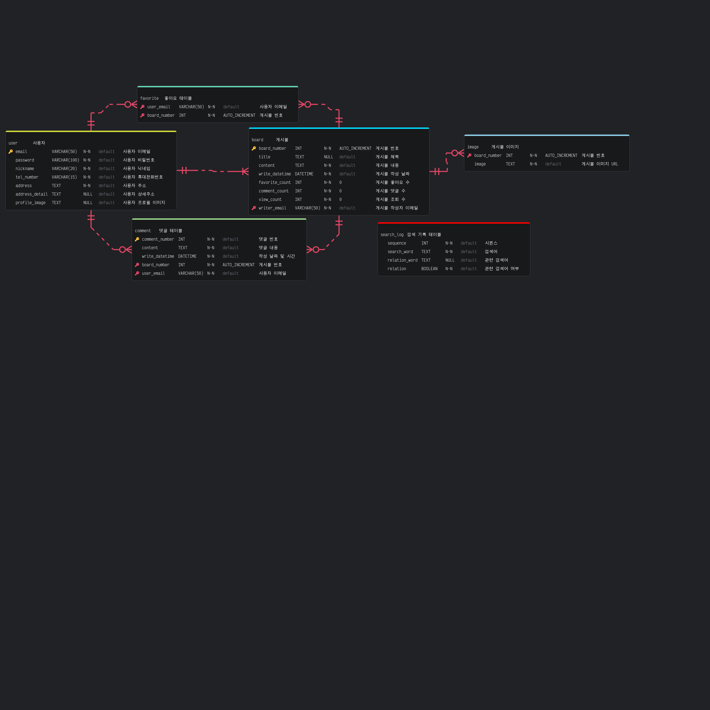

# Blog Project

- **상태:** 개발 중 

## 개발환경
- **OS:** Arch Linux
- **Editor:** nvim, vscode
- **Java:** OpenJDK 17
- **Node:** 22.9.0
- **npm:** 10.8.3
- **Gradle:** 8.10
- **Spring Boot:** 2.7.14
- **MySQL:** 9.0.1 for Linux on x86_64 (MySQL Community Server - GPL)
- **Docker:** 27.2.0

## 사용 기술 목록
- **Spring Boot (Gradle)**
  - JWT

## 진행 상황
- **객체 관계도 설계 (ERD)**
- **명세서 설계**
- **프로젝트 폴더 구성**
- **DB 구성**
  - DML
  - DCL
  - DDL 

## API 명세서

  
API 명세서

- [API 명세서 문서](documents/rest_api_specification.md)

## ERD

